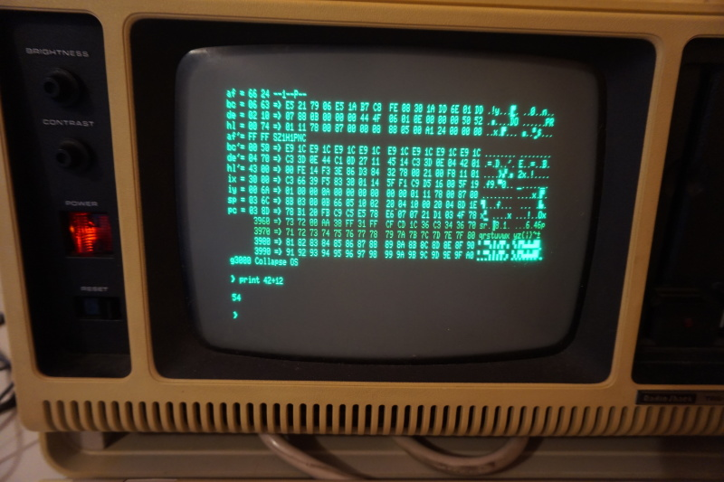

# TRS-80 Model 4p

The TRS-80 (models 1, 3 and 4) are among the most popular z80 machines. They're
very nicely designed and I got my hands on a 4p with two floppy disk drives and
a RS-232 port. In this recipe, we're going to get Collapse OS running on it.

## Not entirely standalone

Collapse OS uses the TRS-80 drivers rather than its own. On most TRS-80 models,
those drivers are on ROM, but in the case of the 4P model, those drivers are on
the TRSDOS disk (well, from what I understand, not all of it, but still, a big
part of it).

It would be preferable to develop drivers from scratch, but it represents a
significant effort for a modest payout (because it's only actually useful when
you want to use a 4P model that has no TRSDOS disk).

Maybe those drivers will be developed later, but it's not a priority for now.

## Floppy or RS-232?

There are many ways to get Collapse OS to run on it. One would involve writing
it to a floppy. I bought myself old floppy drives for that purpose, but I happen
to not have any functional computer with a floppy port on it. I still have the
motherboard of my old pentium, but I don't seem to have a video card for it any
more.

Because my 4p has a RS-232 port and because I have equipment to do serial
communication from modern machines (I didn't have a DB-9 to DB-25 adapter
though, I had to buy one), I chose that route.

## Gathering parts

* A TRS-80 model 4p with a RS-232 port
* A TRSDOS 6.x disk
* A means to do serial communication. In my case, that meant:
    * A USB-to-serial device
    * A null modem cable
    * A DB-9 gender changer
    * A DB-9 to DB-25 adapter

## Overview

We need to send sizeable binary programs through the RS-232 port and then run
it. The big challenge here is ensuring data integrity. Sure, serial
communication has parity check, but it has no helpful way of dealing with
parity errors. When parity check is enabled and that a parity error occurs, the
byte is simply dropped on the receiving side. Also, a double bit error could be
missed by those checks.

What we'll do here is to ping back every received byte back and have the sender
do the comparison and report mismatched data.

Another problem is ASCII control characters. When those are sent across serial
communication channels, all hell breaks lose. When sending binary data, those
characters have to be avoided. We use `tools/ttysafe` for that.

Does TRSDOS have a way to receive this binary inside these constraints? Not to
my knowledge. As far as I know, the COMM program doesn't allow this.

What are we going to do? We're going to punch in a binary program to handle that
kind of reception! You're gonna feel real badass about it too...

## Building the binary

You can start the process by building the binary. Running `make` in this folder
will yield a `os.bin` file. You'll need it later.

## Testing serial communication

The first step here is ensuring that you have bi-directional serial
communication. To do this, first prepare your TRS-80:

    set *cl to com
    setcomm (word=8,parity=no)

The first line loads the communication driver from the `COM/DRV` file on the
TRSDOS disk and binds it to `*cl`, the name generally used for serial
communication devices. The second line sets communication parameters in line
with what is generally the default on modern machine. Note that I left the
default of 300 bauds as-is.

Then, you can run `COMM *cl` to start a serial communication console.

Then, on the modern side, use your favorite serial communication program and set
the tty to 300 baud with option "raw". Make sure you have `-parenb`.

If your line is good, then what you type on either side should echo on the
other side. If it does not, something's wrong. Debug.

## Punching in the goodie

As stated in the overview, we need a program on the TRS-80 that:

1. Listens to `*cl`
2. Echoes each character back to `*cl`
3. Adjusts `ttysafe` escapes
4. Stores received bytes in memory

That program has already been written, it's in `recv.asm` in this folder. You
can get the binary with `zasm < recv.asm | xxd`.

It's designed to run from offset `0x4000` and write received data in `0x3000`
and onwards.

How will you punch that in? The `debug` program! This very useful piece of
software is supplied in TRSDOS. To invoke it, first run `debug (on)` and then
press the `BREAK` key. You'll get the debug interface which allows you to punch
in any data in any memory address. Let's use `0x4000` which is the offset it's
designed for.

For reference: to go back to the TRSDOS prompt, it's `o<return>`.

First, display the `0x4000-0x403f` range with the `d4000<space>` command (I
always press Enter by mistake, but it's space you need to press). Then, you can
begin punching in with `h4000<space>`. This will bring up a visual indicator of
the address being edited. Punch in the stuff with a space in between each byte
and end the edit session with `x`.

But wait, it's not that easy! You see those `0xffff` addresses? They're
placeholders. You need to replace those values with your DCB handle for `*cl`.
See below.

## Getting your DCB address

In the previous step, you need to replace the `0xffff` placeholders in
`recv.asm` with your "DCB" address for `*cl`. That address is your driver
"handle". To get it, first get the address where the driver is loaded in
memory.  You can get this by running `device (b=y)`. That address you see next
to `*cl`?  that's it. But that's not our DCB. 

To get your DBC, go explore that memory area. Right after the part where there's
the `*cl` string, there's the DCB address (little endian). On my setup, the
driver was loaded in `0x0ff4` and the DCB address was 8 bytes after that, with
a value of `0x0238`. Don't forget that z80 is little endian. `38` will come
before `02`.

## Saving that program for later

If you want to save yourself typing for later sessions, why not save the
program you've painfully typed to disk? TRSDOS enables that easily. Let's say
that you typed your program at `0x4000` and that you want to save it to
`RECV/CMD` on your second floppy drive, you'd do:

    dump recv/cmd:1 (start=x'4000',end=x'4030',tra='4000')

A memory range dumped this way will be re-loaded at the same offset through
`load recv/cmd:1`. Even better, `TRA` indicates when to jump after load when
using the `RUN` command. Therefore, you can avoid all this work above in later
sessions by simply typing `recv` in the DOS prompt.

Note that you might want to turn `debug` off for these commands to run. I'm not
sure why, but when the debugger is on, launching the command triggers the
debugger.

## Sending binary through the RS-232 port

Once you're finished punching your program in memory, you can run it with
`g4000<enter>` (not space). If you've saved it to disk, run `recv` instead.
Because it's an infinite loop, your screen will freeze. You can start sending
your data.

To that end, there's the `tools/pingpong` program. It takes a device and a
filename to send. Before you send the binary, make it go through
`tools/ttysafe` first (which just takes input from stdin and spits tty-safe
content to stdout):

    ./ttysafe < os.bin > os.ttysafe

On OpenBSD, the invocation can look like:

    doas ./pingpong /dev/ttyU0 os.ttysafe

You will be prompted for a key before the contents is sent. This is because on
OpenBSD, TTY configuration is lost as soon as the TTY is closed, which means
that you can't just run `stty` before running `pingpong`. So, what you'll do is,
before you press your key, run `doas stty -f /dev/ttyU0 300 raw` and then press
any key on the `pingpong` invocation.

If everything goes well, the program will send your contents, verifying every
byte echoed back, and then send a null char to indicate to the receiving end
that it's finished sending. This will end the infinite loop on the TRS-80 side
and return. That should bring you back to a refreshed debug display and you
should see your sent content in memory, at the specified address (`0x3000` if
you didn't change it).

If there was no error during `pingpong`, the content should be exact.
Nevertheless, I recommend that you manually validate a few bytes using TRSDOS
debugger before carrying on.

*debugging tip*: Sometimes, the communication channel can be a bit stubborn and
always fail, as if some leftover data was consistently blocking the channel. It
would cause a data mismatch at the very beginning of the process, all the time.
What I do in these cases is start a `COMM *cl` session on one side and a screen
session on the other, type a few characters, and try `pingpong` again.

## Running Collapse OS

If everything went well, you can run Collapse OS with `g3000<space>`. You'll
get a usable Collapse OS prompt!

Like with the `recv` program, nothing stops you from dumping that binary to a
floppy.

## Configuration

In addition to the generic basic shell, this build of Collapse OS has support
for floppy drive `:1` as a block device (mapped to device `0`). Block device
commands work as expected.

In addition to this, there is a `flush` command to ensure that dirty buffers are
synced to disk. Make sure you run this after a write operation or before
swapping disks.

There is also a custom `recv` command that does the same "ping pong" as in
`recv.asm`, but once. It puts the result in `A`. This can be useful to send down
a raw CFS: you just need a while loop that repeatedly call `recv:putb a`.
